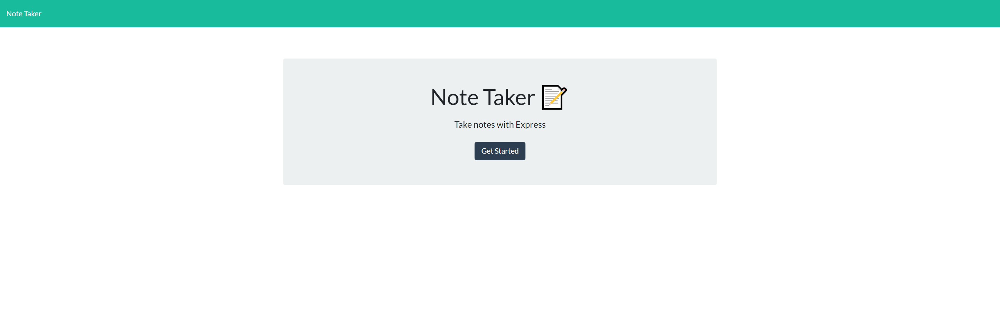
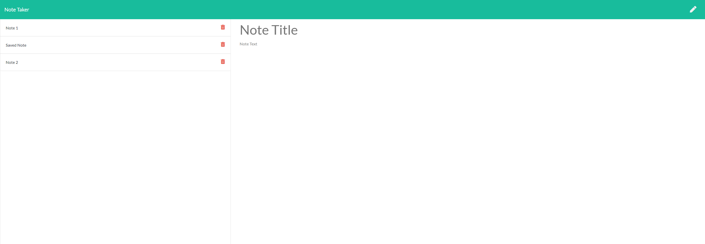
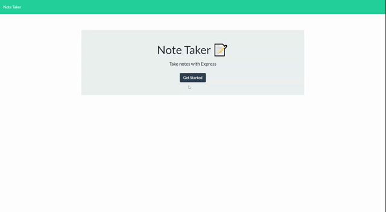

# Note Taker

---

## Description

This is an application that can be used to write, save, and delete notes using an express server backend. Notes are read from and written to a JSON file.

- [Description](#description)
- [User Story](#user-story)
- [Acceptance Criteria](#acceptance-criteria)
- [Application Screenshot](#application-screenshot)
- [Installation](#installation)
- [Usage](#usage)
- [Credits](#credits)

## User Story

```
AS A user, I want to be able to write and save notes

I WANT to be able to delete notes I've written before

SO THAT I can organize my thoughts and keep track of tasks I need to complete
```

## Acceptance Criteria

Application should allow users to create and save notes.

Application should allow users to view previously saved notes.

Application should allow users to delete previously saved notes.

## Application Screenshot


_Main application page screenshot_


_Notes screen for entering note title and text_

## Installation

There is no installation required for this application as it is hosted on a Heroku server. You can access the [Note Taker Application](https://blooming-chamber-39925.herokuapp.com/).

## Usage

To utilize this application, go to the application link provided and click "Get Started". This will open the note taker dashboard, allowing the user to write new notes, view previously saved notes, and delete notes that are no longer needed.

When the user begins typing in the title of the note and the text of the note, the save icon will appear in the top right corner allowing the note to be saved.

Clicking on the saved note titles on the left allows users to pull up previously saved notes. These notes can also be deleted by clicking the red trash icon next to the note the user wants to delete.



_Gif of using the note taker application_

## Credits

Some of the packages used for the development of this application are as follows with links to each.

- [Heroku](https://www.heroku.com/)
  Heroku allows for the hosting of server-side code on their cloud platform. This effectively allows for the application server code to be run on their systems.

- [Express](https://expressjs.com/)
  Allows for creating a server for the web application.

- [Nodemon](https://www.npmjs.com/package/nodemon)
  Package that allows the server to automatically restart when changes are made to the code making the development of the application more efficient.

- [UUID](https://www.npmjs.com/package/uuid)
  Package for creating a universally unique identifier (UUID) based on the [RFC4122](https://www.ietf.org/rfc/rfc4122.txt) standard.

---

© 2020 Neil Gandhi
